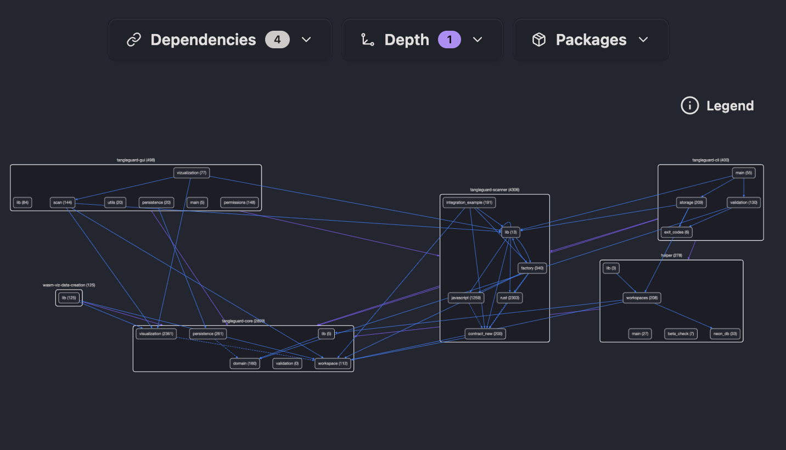

# TangleGuard Scanner

[TangleGuard](https://tangleguard.com/) is a tool to monitor and enforce your software architecture.

With this GitHub Action you can integrate your architecture into [TangleGuard's public directory](https://app.tangleguard.com), where is can be **viewed and analyzed by anybody**. Private scans will be supported in the future too.



## Procedure

Below you see what the action does in detail.

- Checks out your repository
- Downloads TangleGuard CLI and makes it executable
- Extracts repository metadata (owner, name, host) from `.git`
- Scans the architectural of your project
- Uploads scan results to TangleGuard Cloud

## Usage Example

There are four mandatory inputs:

- `language`: Which let's you select the correct scanner to be used
- `upload_results`: Must be set to "true" - the only supported option during evaluation phase
- `make_public`: Must be set to "true" - private scan results are not yet supported
- `description`: Project description for better identification on the website

There are also optional inputs like `ignore_paths` to exclude specific directories from scanning, and `fail_on_findings` to control CI behavior.

### Upload to TangleGuard Cloud

```yaml
name: TangleGuard Scan
on: [push, pull_request]
jobs:
  scan-workspace:
    runs-on: ubuntu-latest
    steps:
      - uses: TangleGuard/github-action@main
        with:
          upload_results: "true"
          make_public: "true"
          language: "rust"
          description: "A Rust-based CLI tool for dependency analysis and architectural visualization"
```

### Validate Only (CI/CD)

Use this example if you only want to validate your codebase for circular dependencies and fail the workflow if any are found. This is useful for enforcing architecture rules in pull requests.

```yaml
name: Architecture Validation
on: [pull_request]
jobs:
  validate-architecture:
    runs-on: ubuntu-latest
    steps:
      - uses: TangleGuard/github-action@main
        with:
          upload_results: "false"
          make_public: "true"
          language: "javascript"
          fail_on_findings: "true" # Fail if circular dependencies are found
```

Set `fail_on_findings: "false"` if you want to see the validation results without failing the workflow.

## Inputs

| Input              | Description                                                                 | Required | Default |
| ------------------ | --------------------------------------------------------------------------- | -------- | ------- |
| `upload_results`   | Must be "true" - only supported option during evaluation phase              | Yes      | -       |
| `make_public`      | Must be "true" - private scan results are not yet supported                 | Yes      | -       |
| `repository`       | Repository in format 'owner/project' (auto-detected from Git if empty)      | No       | -       |
| `language`         | Programming language (rust/javascript)                                      | Yes      | -       |
| `path`             | Path to scan                                                                | No       | `.`     |
| `description`      | Project description for better identification on website                    | Yes      | -       |
| `ignore_paths`     | Comma-separated list of directories to ignore (e.g., 'examples,benchmarks') | No       | -       |
| `fail_on_findings` | Fail the workflow if circular dependencies are found                        | No       | `true`  |

## Deletion of projects from the public directory

To delete the project from the directory, please contact the owner directly via kontakt@jaads.de or create an issue.

## License

This GitHub Action is licensed under the MIT License (see LICENSE file).

However, this action downloads and uses the TangleGuard CLI tool, which is proprietary software subject to separate license terms.
By using this GitHub Action, you agree to the [TangleGuard EULA](https://docs.tangleguard.com/legal/terms/).

**Summary:**

- **GitHub Action Code**: MIT License
- **TangleGuard CLI Tool**: Proprietary (see EULA)
