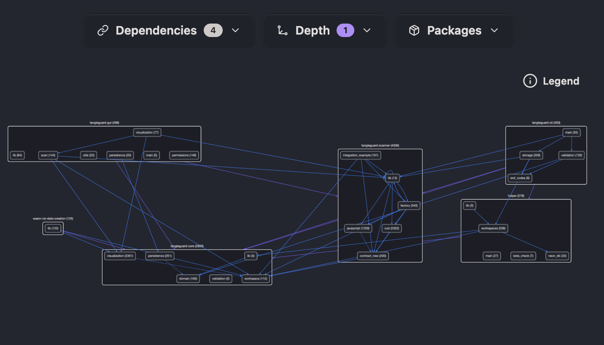

# TangleGuard Scanner

[TangleGuard](https://tangleguard.com/) is a tool to monitor and enforce your software architecture.

You basically have two options how to use this Action:

1. Use the architectural linter: You can run the action on a PR and it will fail if circular dependencies are found and hence the PR could be blocked. That way you ensure your code does not get tangled and does not include anti patterns. See the first example below.
1. Upload results to TangleGuard Cloud: You can run the action e.g. manually, then the codebase within the GitHub runner and send to results to the [Cloud version of TangleGuard](https://app.tangleguard.com). There the dependencies can be analyzed visually without having to install anything locally. This is currently a **public** directory and hence only made for open source projects. See the second example below.



## Usage Examples

### On PR: Detect Architecture Changes (Recommended)

**NEW!** Use this example to detect architecture changes introduced by a pull request. This runs TangleGuard on both the base and head commits, then shows you the impact of your changes:

- ✅ "No issues found" - Clean before and after
- ⚠️ "Issues exist in both" - Your changes didn't introduce new issues
- ❌ "NEW ISSUES INTRODUCED!" - Your PR introduces violations
- 🎉 "ISSUES RESOLVED!" - Your PR fixes existing problems

```yaml
name: TangleGuard PR Change Detection
on: [pull_request]
jobs:
  detect-architecture-changes:
    runs-on: ubuntu-latest
    steps:
      - name: Checkout code
        uses: actions/checkout@v4
        with:
          fetch-depth: 0 # Required for change detection

      - name: Run TangleGuard with change detection
        uses: TangleGuard/github-action@main
        with:
          language: "javascript"
          detect_change: "true" # Enable change detection
          fail_on_findings: "true"
```

### On PR: Simple Validation

Use this example if you only want to validate your codebase for circular dependencies and fail the workflow if any are found. This validates only the current commit.

```yaml
name: Architecture Validation
on: [pull_request]
jobs:
  validate-architecture:
    runs-on: ubuntu-latest
    steps:
      - uses: TangleGuard/github-action@main
        with:
          language: "javascript"
          fail_on_findings: "true" # Fail if circular dependencies are found
```

Set `fail_on_findings: "false"` if you want to see the validation results without failing the workflow.

### On PR: Upload to public directory

This is for open source projects ONLY.

We'd be happy to host the UI for the monitoring if you work on a public projects which is licensed under the MIT license or Apache 2.0 license.

```yaml
name: TangleGuard Scan
on: [push, pull_request]
jobs:
  scan-workspace:
    runs-on: ubuntu-latest
    steps:
      - uses: TangleGuard/github-action@main
        with:
          upload_results: "true"
          language: "rust" # <-- ADJUST
          description: "A CLI tool that.. " # <-- ADJUST (required when uploading)
```

Private and proprietary repositories will be supported, too. TangleGuard keeps you architecture data very serious. To support private repositories, TangleGuard wants to have setup a proper multi-tenant secure platform. This will need resources to implement and infrastructure. If you are interested in a hosted, private version of TangleGuard, please contact us at kontakt@jaads.de.

## All Inputs

This GitHub Action can be configured in a few ways, depending on your needs. Below you find some examples, which should help you get started.

| Input              | Description                                                                      | Required                         | Default |
| ------------------ | -------------------------------------------------------------------------------- | -------------------------------- | ------- |
| `upload_results`   | Upload scan results to TangleGuard Cloud (public directory)                      | No                               | false   |
| `repository`       | Repository in format 'owner/project' (auto-detected from Git if empty)           | No                               | -       |
| `language`         | Programming language (rust/javascript)                                           | Yes                              | -       |
| `path`             | Path to scan                                                                     | No                               | `.`     |
| `description`      | Project description for better identification on website                         | Yes (when `upload_results=true`) | -       |
| `ignore_paths`     | Comma-separated list of directories to ignore (e.g., 'examples,benchmarks')      | No                               | -       |
| `fail_on_findings` | Fail the workflow if circular dependencies are found                             | No                               | true    |
| `detect_change`    | Enable change detection between PR base and head (requires `pull_request` event) | No                               | false   |

## Change Detection Feature

When `detect_change` is enabled, the action analyzes both the base and head commits of a pull request to show the impact of your changes:

- **PASS → PASS**: No issues found in either commit ✅
- **FAIL → FAIL**: Issues exist in both commits, but no new ones introduced ⚠️
- **PASS → FAIL**: New architecture violations introduced ❌ (will fail the action)
- **FAIL → PASS**: Existing issues resolved 🎉

**Requirements:**

- Must be run on a `pull_request` event
- Requires `fetch-depth: 0` in the checkout step to access base commit

**Example Output:**

```
📊 Analyzing changes between:
   Base: abc123
   Head: def456

🔍 Analyzing BASE commit (abc123)...
Base analysis complete (exit code: 0)

🔍 Analyzing HEAD commit (def456)...
Head analysis complete (exit code: 1)

📈 Change Impact Summary:
==========================
❌ NEW ISSUES INTRODUCED!
   Status: PASS → FAIL

⚠️  Your changes introduce new architecture violations!
   Please review the head output above for details.
```

## Deletion of projects from the public directory

To delete the project from the directory, please contact the owner directly via kontakt@jaads.de or create an issue.

## License

This GitHub Action is licensed under the MIT License (see LICENSE file).

However, this action downloads and uses the TangleGuard CLI tool, which is proprietary software subject to separate license terms.
By using this GitHub Action, you agree to the [TangleGuard EULA](https://docs.tangleguard.com/legal/terms/).

**Summary:**

- **GitHub Action Code**: MIT License
- **TangleGuard CLI Tool**: Proprietary (see EULA)
