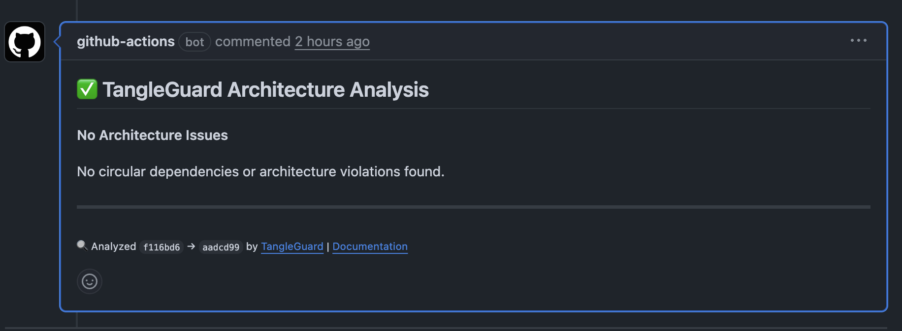

# TangleGuard

[TangleGuard](https://tangleguard.com/) monitors and enforces your software architecture.
This GitHub Action runs TangleGuard in your CI workflow, to you don't suffer from architecture erosion.

The Action detects circular dependencies and violations against the user defined [target architecture](https://tangleguard.com/docs/getting-started/target-definition) - for example on a pull request.



## Usage Examples

### Detect Architecture Changes on PR

Use this example to detect architecture changes introduced by a pull request.
This runs TangleGuard on both the base and head commits, then shows you the impact of your changes:

- ✅ "No issues found" - Clean before and after
- ⚠️ "Issues exist in both" - Your changes didn't introduce new issues
- ❌ "NEW ISSUES INTRODUCED!" - Your PR introduces violations
- 🎉 "ISSUES RESOLVED!" - Your PR fixes existing problems

```yaml
name: TangleGuard PR Change Detection
on: [pull_request]

permissions:
  contents: read # Required to check out the repo (private repos fail without this)
  pull-requests: write # Required to post a comment on the PR

jobs:
  detect-architecture-changes:
    runs-on: ubuntu-latest
    steps:
      - name: Run TangleGuard's change detection
        uses: TangleGuard/github-action@main
        with:
          language: "javascript" # <-- ADJUST
          detect_change: "true" # Enable change detection
          fail_on_findings: "true" # <-- ADJUST
```

The above configuration is recommended for projects that include circular dependencies or rule violations already and the goal is to not introduce more of those violations.

### On PR: Simple Validation

Use this example if you only want to validate your codebase and fail the workflow if any violations are found.
This does not include a A/B testing as the configuration above.
Instead it just runs the violations once on the latest commit.

```yaml
name: Architecture Validation
on: [pull_request]

permissions:
  contents: read # Required to check out the repo (private repos fail without this)

jobs:
  validate-architecture:
    runs-on: ubuntu-latest
    steps:
      - uses: TangleGuard/github-action@main
        with:
          language: "javascript" # <-- ADJUST
          fail_on_findings: "true" # Fail if circular dependencies are found
```

Set `fail_on_findings: "false"` if you want to see the validation results without failing the workflow.

### On PR: Upload to public directory (experimental)

We'd be happy to host the UI for the architecture analysis for projects under the MIT license or Apache 2.0 license.
The configuration below, will uploaded to the result [public directory](https://app.tangleguard.com/) for public analysis.

```yaml
name: TangleGuard Scan
on: [push, pull_request]

permissions:
  contents: read # Required to check out the repo (private repos fail without this)

jobs:
  scan-workspace:
    runs-on: ubuntu-latest
    steps:
      - uses: TangleGuard/github-action@main
        with:
          upload_results: "true"
          api_token: ${{ secrets.TANGLEGUARD_API_TOKEN }} # <-- Required when uploading
          description: "A CLI tool that.. " # <-- ADJUST (required when uploading)
          language: "rust" # <-- ADJUST
```

To upload results, you need an API token. Create one in the [TangleGuard web app](https://app.tangleguard.com/), then add it to your repository as an [encrypted secret](https://docs.github.com/en/actions/security-guides/using-secrets-in-github-actions) named `TANGLEGUARD_API_TOKEN` and reference it via the `api_token` input as shown above. Never paste the token directly into your workflow file.

Private repositories will be supported, too.
If you are interested in a hosted, private version of TangleGuard, please contact us at kontakt@jaads.de.
We'll setup encryption and row level access control for proper, secure multi tenant platform.

## All Inputs

This GitHub Action can be configured in a few ways, depending on your needs. Below you find some examples, which should help you get started.

| Input              | Description                                                                      | Required                         | Default |
| ------------------ | -------------------------------------------------------------------------------- | -------------------------------- | ------- |
| `upload_results`   | Upload scan results to TangleGuard Cloud (public directory)                      | No                               | false   |
| `api_token`        | TangleGuard Cloud API token (pass via an encrypted secret)                       | Yes (when `upload_results=true`) | -       |
| `repository`       | Repository in format 'owner/project' (auto-detected from Git if empty)           | No                               | -       |
| `language`         | Programming language (rust/javascript)                                           | Yes                              | -       |
| `path`             | Path to scan                                                                     | No                               | `.`     |
| `description`      | Project description for better identification on website                         | Yes (when `upload_results=true`) | -       |
| `ignore_paths`     | Comma-separated list of directories to ignore (e.g., 'examples,benchmarks')      | No                               | -       |
| `fail_on_findings` | Fail the workflow if circular dependencies are found                             | No                               | true    |
| `detect_change`    | Enable change detection between PR base and head (requires `pull_request` event) | No                               | false   |

## Troubleshooting

### "Resource not accessible by integration" Error

If you see this error when the action tries to post a PR comment, it means the GitHub token doesn't have permission to write comments.

**Solution 1: Add permissions to your workflow** (Recommended)

Add the `permissions` section to your workflow file:

```yaml
permissions:
  pull-requests: write # Required to post PR comments
```

**Solution 2: Change repository/organization settings**

1. Go to **Settings** → **Actions** → **General** → **Workflow permissions**
2. Select **"Read and write permissions"**
3. Save changes

Note: For organization repositories, this setting might be controlled at the organization level. You'll need organization admin access to change it.

### Other Common Issues

**Issue**: `fetch-depth: 0` is missing

- **Solution**: Add `fetch-depth: 0` to your checkout step for change detection to work

**Issue**: Validation fails with "Unrecognized argument"

- **Solution**: Make sure you're using the latest version of the action (`@main` or a specific version tag)

## Deletion of projects from the public directory

To delete the project from the directory, please contact the owner directly via kontakt@jaads.de or create an issue.

## License

This GitHub Action is licensed under the MIT License (see LICENSE file).

However, this action downloads and uses the TangleGuard CLI tool, which is proprietary software subject to separate license terms.
By using this GitHub Action, you agree to the [TangleGuard EULA](https://tangleguard.com/legal/eula).

**Summary:**

- **GitHub Action Code**: MIT License
- **TangleGuard CLI Tool**: Proprietary (see EULA)
